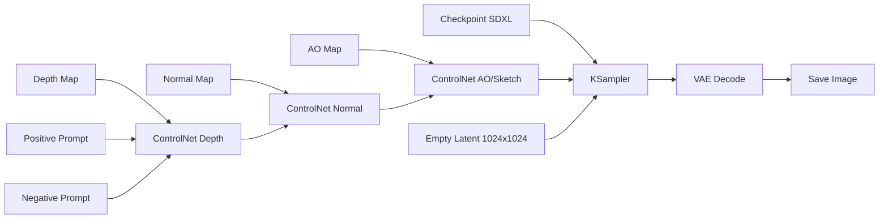

# Workflows ComfyUI para Generación de Interiores Fotorrealistas

Este directorio contiene workflows de ComfyUI diseñados para transformar renders sintéticos de Blender (habitaciones vacías) en interiores fotorrealistas completamente amueblados usando ControlNet.

## Flujo de Trabajo

```
Blender (geometría limpia)
    → Renders técnicos (depth, normal, AO, albedo)
    → ComfyUI + ControlNet
    → Imagen fotorrealista con muebles
```

## Workflows Disponibles

### 1. `interior_depth_only.json` (Recomendado para empezar)
**Usa:** Solo Depth Map
**Mejor para:** Primeras pruebas, resultados rápidos
**ControlNet strength:** 1.0 (máxima preservación de geometría)

### 2. `interior_multi_controlnet.json` (Máxima calidad)
**Usa:** Depth + Normal + AO
**Mejor para:** Resultados finales de alta calidad
**ControlNet strengths:**
- Depth: 1.0 (geometría principal)
- Normal: 0.6 (detalles de superficie)
- AO: 0.35 (sombras sutiles)

### 3. `example.json`
Workflow de ejemplo de tu instalación de ComfyUI (referencia).

---

## Preparación de Archivos de Blender

### Desde tu generador de escenas

Tu proyecto ya genera automáticamente los passes necesarios:

```bash
# Generar una escena aleatoria con todos los passes
"C:\Program Files\Blender Foundation\Blender 4.2\blender.exe" --background --python generate_random_room.py
```

Esto crea:
- `interior_00000_rgb.png` - Render RGB
- `interior_00000_depth.png` - **Depth map (REQUERIDO)**
- `interior_00000_normal.png` - **Normal map (opcional)**
- `interior_00000_ao.png` - **Ambient Occlusion (opcional)**
- `interior_00000_albedo.png` - Albedo
- `interior_00000.json` - Metadatos de cámara

### Para usar con ComfyUI

Copia los archivos necesarios a la carpeta de inputs de ComfyUI:

```bash
# En tu caso, probablemente algo como:
# cp output_clean_rooms/interior_00000_*.png /ruta/a/comfyui/input/
```

---

## Uso de los Workflows

### Paso 1: Instalar ControlNets necesarios

Necesitas descargar los modelos ControlNet para SDXL y colocarlos en `ComfyUI/models/controlnet/`:

#### Para `interior_depth_only.json`:
- `diffusers_xl_depth_full.safetensors`
  - Fuente: [Diffusers XL Depth](https://huggingface.co/diffusers/controlnet-depth-sdxl-1.0)

#### Para `interior_multi_controlnet.json` (además del anterior):
- `sai_xl_normalbae.safetensors`
  - Fuente: [Stability AI Normal BAE](https://huggingface.co/stabilityai/control-lora)
- `t2i-adapter_xl_sketch.safetensors`
  - Fuente: [T2I-Adapter Sketch](https://huggingface.co/TencentARC/t2i-adapter-sketch-sdxl-1.0)

### Paso 2: Cargar el workflow en ComfyUI

1. Abre ComfyUI en tu navegador
2. Click en "Load" (o arrastra el archivo JSON)
3. Selecciona `interior_depth_only.json` o `interior_multi_controlnet.json`

### Paso 3: Configurar las imágenes de entrada

En los nodos **LoadImage**, cambia los nombres de archivo:
- Nodo 2 (Depth): `interior_00000_depth.png`
- Nodo 3 (Normal): `interior_00000_normal.png`
- Nodo 4 (AO): `interior_00000_ao.png`

### Paso 4: Ajustar el prompt (opcional)

**Positive prompt (Nodo 8):**
```
modern interior living room, realistic, photorealistic, detailed textures,
wooden floor, white walls, contemporary furniture, large windows with
natural lighting, sofa, coffee table, plants, decorative items,
high quality, 8k, architectural photography, warm atmosphere
```

Puedes cambiar `living room` por:
- `bedroom` - Dormitorio
- `kitchen` - Cocina
- `bathroom` - Baño
- `home office` - Oficina
- `dining room` - Comedor

**Negative prompt (Nodo 9):**
```
blurry, low quality, cartoon, painting, sketch, unrealistic, distorted,
deformed, bad geometry, wrong perspective, duplicate objects, floating objects,
bad lighting, text, watermark
```

### Paso 5: Configurar parámetros de generación (Nodo KSampler)

**Recomendaciones:**
- **Seed:** `randomize` para variedad, o número fijo para reproducibilidad
- **Steps:** 20-30 (más steps = mejor calidad, más lento)
- **CFG Scale:** 7.0-8.0 (mayor = más fiel al prompt)
- **Sampler:** `dpmpp_2m` o `dpmpp_2m_sde` (rápido y calidad)
- **Scheduler:** `karras` (buena distribución de noise)
- **Denoise:** 1.0 (generación completa desde cero)

### Paso 6: Ejecutar

Click en "Queue Prompt" y espera la generación.

---

## Ajustes de ControlNet

Los valores de **strength** en los nodos ControlNetApplyAdvanced controlan cuánto influye cada mapa:

### `interior_depth_only.json`
```
Depth: strength=1.0, start=0.0, end=1.0
```
- Máxima preservación de geometría durante todo el proceso

### `interior_multi_controlnet.json`
```
Depth:  strength=1.0, start=0.0, end=1.0   (geometría principal - siempre activo)
Normal: strength=0.6, start=0.0, end=0.8   (detalles superficie - 80% del proceso)
AO:     strength=0.35, start=0.0, end=0.6  (sombras sutiles - 60% del proceso)
```

**Cómo ajustar:**

| Problema | Solución |
|----------|----------|
| Geometría no se respeta | Aumentar `strength` de Depth a 1.2-1.5 |
| Imagen muy plana/aburrida | Reducir `strength` de Depth a 0.7-0.8 |
| Paredes/pisos con texturas raras | Reducir `strength` de Normal a 0.3-0.4 |
| Falta detalle en superficies | Aumentar `strength` de Normal a 0.7-0.9 |
| Demasiadas sombras artificiales | Reducir `strength` de AO a 0.2 o desactivar |

---

## Estructura del Workflow Multi-ControlNet



**Flujo:**
1. Checkpoint carga Juggernaut XL
2. Los 3 ControlNets se aplican en cadena (depth → normal → AO)
3. Cada ControlNet modifica el conditioning (positive/negative)
4. KSampler genera la imagen respetando todos los controles
5. VAE decodifica el latent a imagen RGB
6. Se guarda el resultado

---

## Ejemplos de Prompts para Diferentes Habitaciones

### Living Room (Sala de estar)
```
modern living room interior, scandinavian design, large L-shaped sofa,
wooden coffee table, indoor plants, minimalist decor, natural light
from windows, warm lighting, photorealistic, 8k
```

### Bedroom (Dormitorio)
```
cozy bedroom interior, queen size bed with white linens, wooden nightstands,
modern pendant lights, area rug, plants, contemporary design, soft morning
light, photorealistic, architectural photography
```

### Kitchen (Cocina)
```
modern kitchen interior, white cabinets, marble countertops, stainless steel
appliances, island with bar stools, pendant lights, minimalist design,
natural lighting, photorealistic, 8k, clean
```

### Bathroom (Baño)
```
luxury bathroom interior, modern vanity, large mirror, walk-in shower,
marble tiles, chrome fixtures, plants, ambient lighting, spa-like atmosphere,
photorealistic, high-end design
```

### Home Office (Oficina)
```
modern home office, wooden desk, ergonomic chair, bookshelf, computer setup,
plants, natural light from window, minimalist decor, professional workspace,
photorealistic, architectural visualization
```

---

## Troubleshooting

### Problema: "Invalid workflow against zod schema: Validation error: Invalid uuid at 'id'"
**Solución:** El campo `id` del workflow debe ser un UUID válido. Los workflows en esta carpeta ya están corregidos. Si creas workflows personalizados, asegúrate de usar un UUID válido (ej: "a1b2c3d4-e5f6-47a8-b9c0-d1e2f3a4b5c6").

### Problema: "Failed to load ControlNet model"
**Solución:** Verifica que los archivos `.safetensors` estén en `ComfyUI/models/controlnet/`

### Problema: La imagen generada no respeta la geometría
**Solución:**
1. Aumenta `strength` del Depth ControlNet a 1.2-1.5
2. Reduce CFG scale a 6.0-7.0
3. Verifica que el depth map sea correcto (más claro = más cerca)

### Problema: La imagen sale negra o corrupta
**Solución:**
1. Verifica que el checkpoint Juggernaut XL esté cargado correctamente
2. Prueba reducir la resolución a 768x768
3. Cambia el sampler a `euler` o `ddim`

### Problema: Los muebles flotan o están en posiciones extrañas
**Solución:**
1. Aumenta steps a 30-40
2. Modifica el prompt para ser más específico: "furniture on the floor, realistic placement"
3. Añade a negative prompt: "floating objects, unrealistic placement"

### Problema: Colores muy saturados o irreales
**Solución:**
1. Reduce CFG scale a 5.0-6.0
2. Añade a negative prompt: "oversaturated, unrealistic colors"
3. Prueba usar el albedo map como referencia de color

---

## Batch Processing (Procesamiento por lotes)

Para procesar múltiples escenas, puedes usar la API de ComfyUI:

```python
# Ejemplo básico (requiere ComfyUI server corriendo)
import requests
import json

# Cargar workflow
with open('interior_depth_only.json', 'r') as f:
    workflow = json.load(f)

# Modificar parámetros
workflow['nodes'][1]['widgets_values'][0] = 'interior_00001_depth.png'  # LoadImage
workflow['nodes'][7]['widgets_values'][0] = 12345  # Seed diferente

# Enviar a ComfyUI
response = requests.post(
    'http://localhost:8188/prompt',
    json={'prompt': workflow}
)
```

---

## Integración con tu Pipeline

### Pipeline completo:

1. **Generar escenas en Blender:**
   ```bash
   blender --background --python generate_clean_rooms.py -- --num-scenes 100
   ```

2. **Procesar con ComfyUI:**
   - Cargar workflow
   - Batch processing con diferentes prompts
   - Generar 3-5 variaciones por escena

3. **Resultado:**
   - 100 escenas × 3-5 variaciones = 300-500 imágenes fotorrealistas
   - Todas con geometría conocida (de los JSON)
   - Listas para entrenar modelo de pose de cámara

---

## Tips y Mejores Prácticas

1. **Empieza simple:** Usa primero `interior_depth_only.json` para validar
2. **Itera prompts:** Genera varias versiones con diferentes estilos de decoración
3. **Varía el seed:** Para cada escena, genera 3-5 seeds diferentes
4. **Guarda los parámetros:** Anota qué configuración funciona mejor
5. **Batch inteligente:** Agrupa escenas similares (mismo tamaño de habitación)

---

## Modelos Alternativos

Los workflows usan **RealVisXL_V5.0** por defecto. También puedes usar:

- **JuggernautXL_v9** - Muy bueno para fotorrealismo
- **DreamShaperXL** - Más artístico pero realista
- **ProtoVisionXL** - Muy bueno para arquitectura
- **ArchitectureRealMix** - Especializado en interiores

Cambia el valor en `widgets_values` del nodo CheckpointLoaderSimple.

---

## Próximos Pasos

- [ ] Probar workflow con tus renders de Blender
- [ ] Ajustar strengths de ControlNet según resultados
- [ ] Crear biblioteca de prompts para diferentes estilos
- [ ] Implementar batch processing
- [ ] Integrar con pipeline de entrenamiento

---

**Proyecto:** Perspectiva2 - Clean Rooms → ComfyUI → Dataset Fotorrealista
**Objetivo:** Generar dataset de interiores fotorrealistas con pose de cámara conocida
